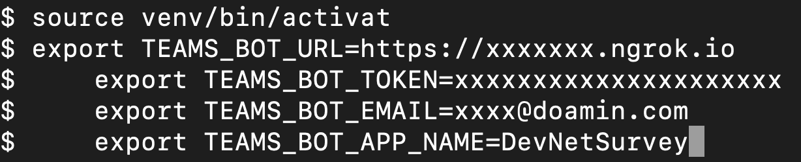
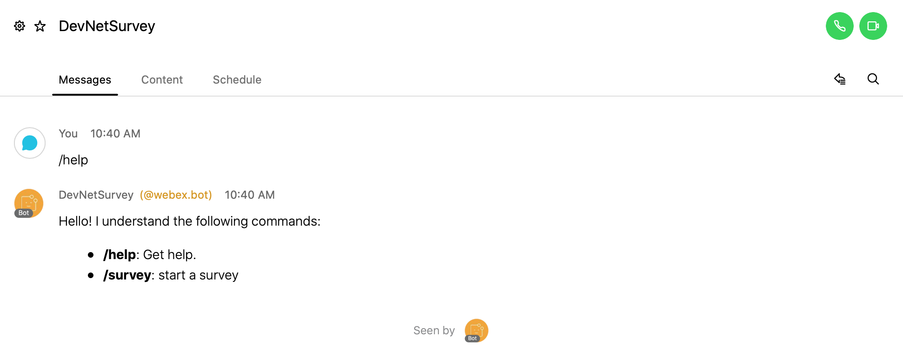

# Survey using Buttons and Cards + Smartsheet API

Webex Teams bot is created for completing survey. They survey will be completed using Buttons and Cards as part of the bot.The result of the survey is posted in smartsheet after submitting though buttons and cards.

Pre-requisites:
1.  Python (using 3.8 for this project)
2.  Webex Teams Bot
3.  ngrok or any other secure tunneling program (required to run the bot locally)
4.  Smartsheet account and sheet creation previleges

STEPS -
1.  Create a bot using following instructions. https://developer.webex.com/docs/bots#creating-a-webex-teams-bot. Once the bot is created, note down or copy the Bot's Access Token which will be needed to run the bot locally. For this project, sample bot has been created named Survey
2.  Create smartsheet account (for this project smartsheet account was already created and had a previlege to create new sheet)
https://www.youtube.com/watch?v=cJUlyPt3zq4
3.  Generate Smartsheet API using following link. https://www.youtube.com/watch?v=R4pow3y-BTk. Copy the token and assign it to variable called as TOKEN. 
4. Create python virtual environment using 3.8
    - python3.8 -m venv venv
    
    
    
    - source venv/bin/activate
    
    
    
    - Enter following commands in terminal to set the env variables:
        -   export TEAMS_BOT_URL=https://xxxxxx (replace it with url generated when your run ngrok http 7000 in terminal in
            a separate tab)
        -   export TEAMS_BOT_TOKEN=xxxxx (replace it with your bot access token that you copied in step 1)
        -   export TEAMS_BOT_EMAIL=replace it with your email id
        -   export TEAMS_BOT_APP_NAME=DevNetSurvey
        
        
        
     - open new terminal and enter ngrok http 7000
     
     
     
     - run survey.py using python survey.py
     
     
     
     - log in to Webex Teams app and search for the bot named DevNetSurvey@webex.bot
     
     
     
     - In 1:1 with bot, type /help to find out what commands are supported (for now only one command is supported - /survey)
     
     
     
     - Enter command /survey to get the survey buttons and cards to complete the survey
     
     
    

