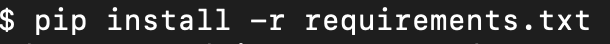
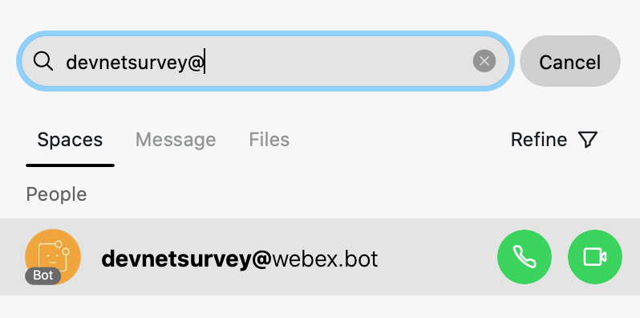
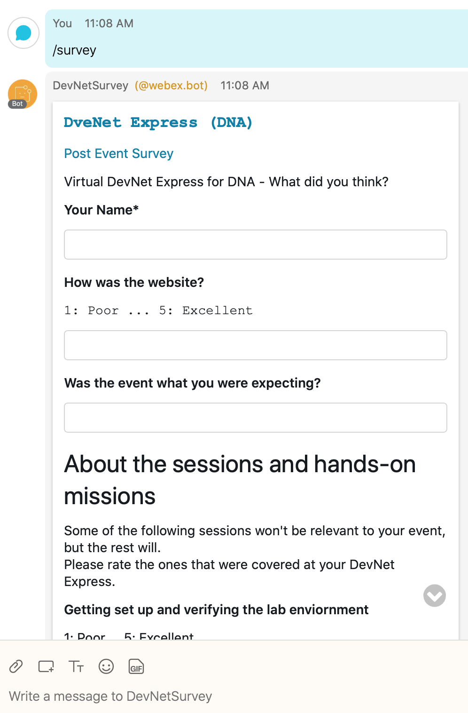
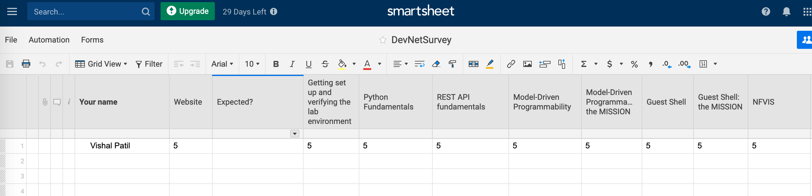

# Surveys for Webex Teams

Webex Teams bot is created for completing survey. They survey will be completed using Buttons and Cards (Guide - https://developer.webex.com/docs/api/guides/cards) as part of the bot.The result of the survey is posted in smartsheet after submitting though buttons and cards.

Pre-requisites:
1.  MacOS/Linux (using macOS Catalina 10.15.5 version for this project)
2.  Python (using 3.8 for this project)
3.  Webex Teams Bot
4.  ngrok or any other secure tunneling program (required to run the bot locally)
5.  Smartsheet account (you can login using your Google account - free access for 30 days)

STEPS -
1.  Create a bot using following instructions. https://developer.webex.com/docs/bots#creating-a-webex-teams-bot. Once the bot is created, note down or copy the Bot's Access Token which will be needed to run the bot locally. For this project, sample bot has been created named DevNetSurvey
2. Create sheet named DevNetSurvey in smartsheet using this quick tutorial. https://www.youtube.com/watch?v=cJUlyPt3zq4
3. Copy the columns from the DevNetSurvey.xml which is part of this repo (make sure you copy columns as is)
4. Generate Smartsheet Access Token using following link. https://www.youtube.com/watch?v=R4pow3y-BTk. Copy the token and assign it to variable called as TOKEN in setup.py. This is needed so that your bot can post the survey results to the sheet
5. Running survey.py
    - python3.8 -m venv venv
    
    
    
    - source venv/bin/activate
    
    
    
    - Enter following commands in terminal to set the env variables:
        -   export TEAMS_BOT_URL=https://xxxxxx (replace it with url generated when your run ngrok http 7000 in terminal in
            a separate tab)
        -   export TEAMS_BOT_TOKEN=xxxxx (replace it with your bot access token that you copied in step 1)
        -   export TEAMS_BOT_EMAIL=replace it with your email id
        -   export TEAMS_BOT_APP_NAME=DevNetSurvey
        
     
        
     - Install ngrok using command brew cask install ngrok (checkout the details if you wish to donwload it and install it on different platforms - https://ngrok.com/download)
     
     
     
     - open new terminal and enter ngrok http 7000
     
     
     
     - go back to first trerminal window and run pip install -r requirements.txt to install the required libraries.
     
     
     
     - run survey.py using python survey.py
     
     
     
6. Running bot in Webex Teams
     - Log in to Webex Teams app and search for the bot named DevNetSurvey@webex.bot
     
     
     
     - In 1:1 space with bot, type /help to find out what commands are supported
     
     
     
     - Enter command /survey to get the survey buttons and cards to complete the survey
            
     
     
7. Fill out the survey and hit submit. After submitting, go to your smartsheet where you have created the sheet named           DevNetSurvey and verify that those filled out values are there.
     
     
    

